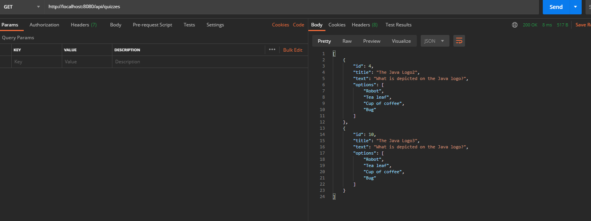
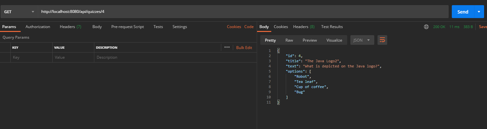
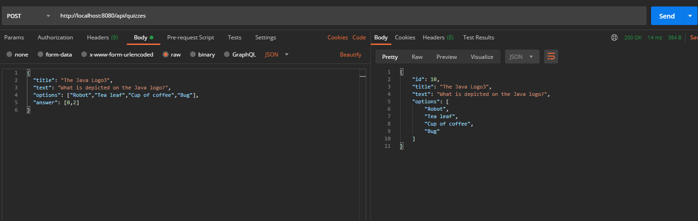
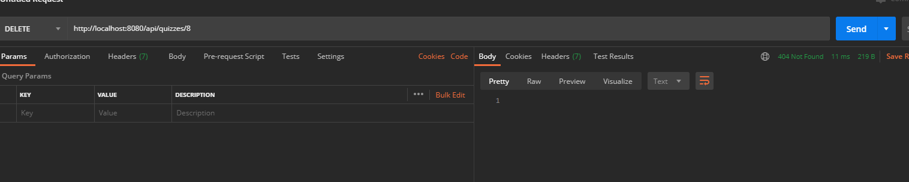
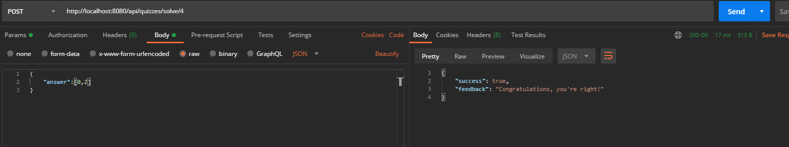
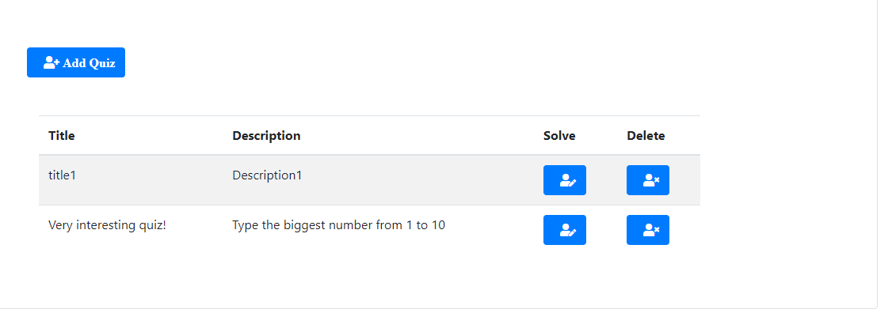
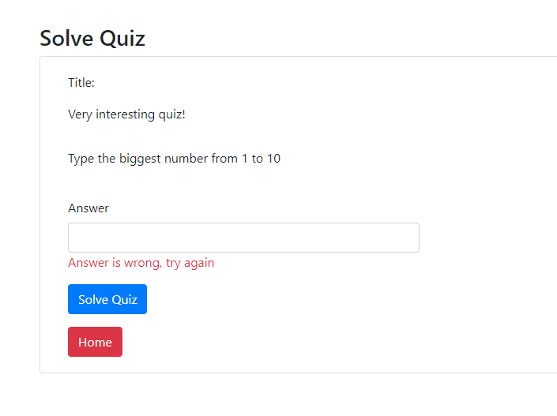

# Quiz
Quiz app  
backend - Spring boot REST APi(с возможностью выбора между Spring data/Hibernate), так же сделал frontend на React(но там нет авторизации)  
Есть 2 пользователя user:user admin:admin, юзер может только получать квиз и решать его, а админ так же может удалить и добавить   
Целью было написать бекенд-часть на Java с использованием Java(Spring boot,Spring MVC, Spring data, PostgreSQL)  
Сам по себе сервис представляет набор задач(Квизов) и возможность их решения, удаления и добавления  
Пример использования API приведен на скринах ниже:  
Получение всех квизов:  
  
Получение одного квиза по ид:  
  
Получение всех квизов:  
  
Добаваление квиза:  
  
Удаление квиза:  
  
Решение квиза:  
  
  
quiz-web-app-v3 это монолитное приложение на Spring boot с использованием MongoDB/H2, ответ регистроустойчив
Скриншоты ниже:  
Список квизов:  
  
Правильный ответ на квиз:  
  
Неправильный ответ на квиз:  

  
Осустствует проверка на "дурочка"  
Todo: Paging, Docke...
